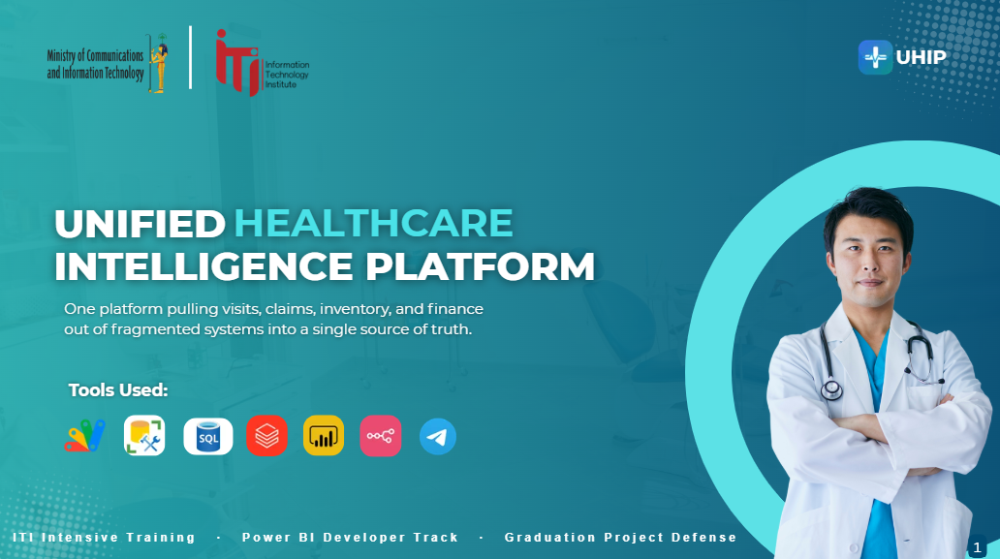
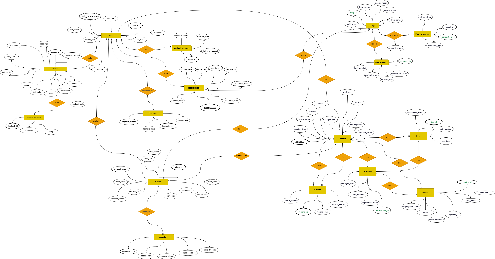
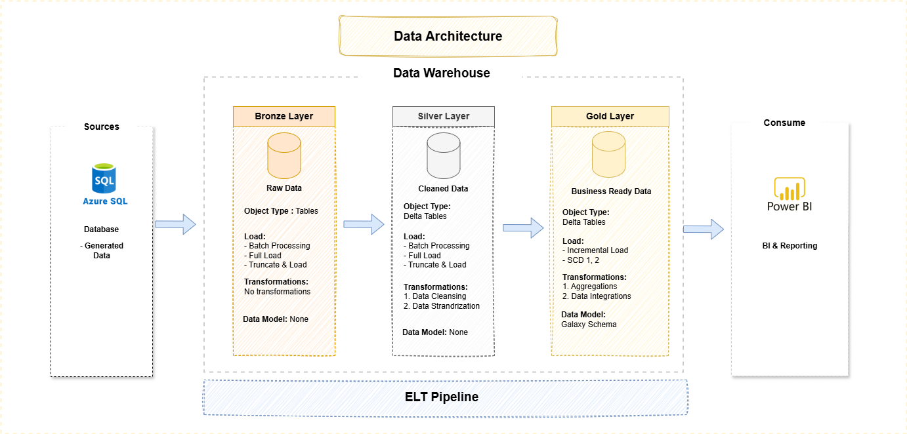
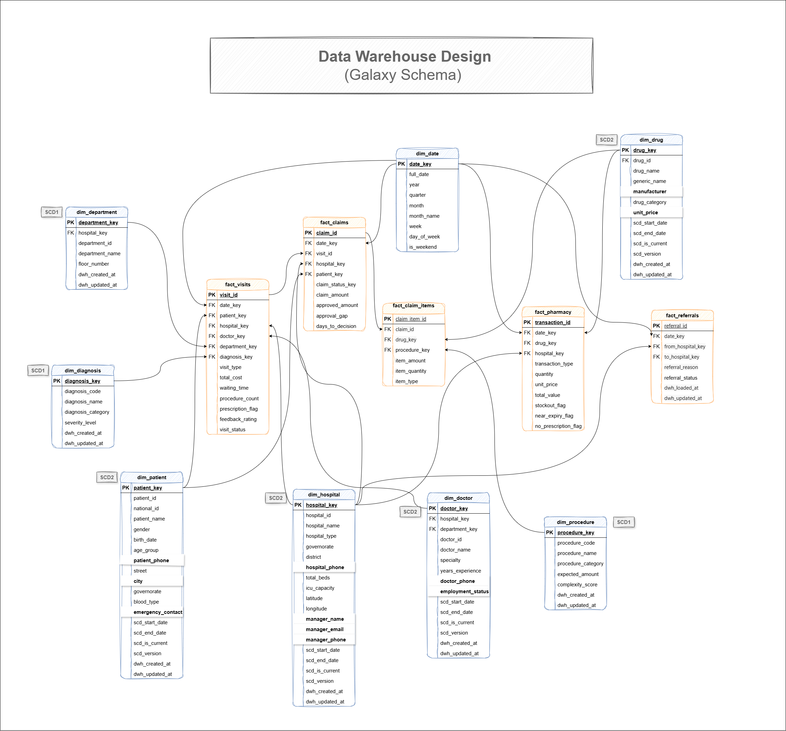

# 🏥 Unified Healthcare Intelligence Platform (UHIP)

> One platform pulling visits, claims, inventory, and finance out of fragmented systems into a single source of truth.

## 📌 Overview

Unified Healthcare Intelligence Platform (UHIP) is an end-to-end healthcare analytics and intelligence solution designed to unify fragmented healthcare data and transform it into actionable insights.

The platform integrates healthcare operations, patient activities, insurance claims, pharmacy transactions, and financial data into a centralized analytical environment.

Built as a graduation project in the **ITI – Power BI Developer Track**.

---
# 🚨 Problem Statement

Healthcare data is often distributed across multiple disconnected systems, causing:

- Fragmented patient records
- Limited healthcare visibility
- Inefficient resource utilization
- Delayed decision-making
- Difficulty tracking claims and operational performance

UHIP addresses these challenges through centralized data integration and analytics.

---
# 🎯 Project Objectives

- Create a unified patient healthcare view
- Enable healthcare monitoring and resource allocation
- Improve operational efficiency
- Support government and executive decision-making
- Provide AI-powered healthcare assistance
- Deliver real-time reporting and analytics

---
# 🗄️ Database Design.

## Core Entities

- Patients
- Visits
- Claims
- Hospitals
- Doctors
- Departments
- Referrals
- Prescriptions
- Drugs

## Database Quality Assurance

✔ Primary Key Integrity  
✔ Foreign Key Validation  
✔ Referential Integrity  
✔ Relationship Cardinality Verification  

---
# 🏗️ System Architecture.

## Architecture Layers

### Data Sources
- Azure SQL Database

### Data Engineering
- Databricks
- PySpark
- ELT Pipelines

### Data Storage
- Medallion Architecture
  - Bronze Layer → Raw Data
  - Silver Layer → Cleaned Data
  - Gold Layer → Business Analytics

### Data Consumption
- Power BI Dashboards
- SSRS Reports
- AI SQL Agent
- Telegram Chatbot

---

# ⚙️ Data Engineering Pipeline

## ELT Workflow

1. Data Ingestion from Azure SQL Database
2. Data Validation
3. Data Quality Checks
4. Transformations in Databricks
5. Data Warehouse Loading
6. Dashboard & Reporting Layer

---

# 🧹 Data Quality & Transformations

Implemented data preparation processes including:

### Quality Checks
- Data type validation
- NULL detection
- Duplicate detection
- String cleaning
- Outlier checks
- Standardization rules

### Transformations
- Duplicate removal
- String trimming
- Data cleansing
- Aggregations
- Data integration
- Data modeling

---

# 🏛️ Data Warehouse Design

Implemented a **Galaxy Schema** to support analytical reporting and scalable business intelligence.

---

# 📊 Dashboard Modules

## Executive Overview
- Healthcare KPIs
- Resource Allocation
- Decision Support

## Financial Analytics
- Cost Analysis
- Revenue Tracking
- Claims Performance

## Patient Analytics
- Population Profile
- Patient Behavior
- Disease Analysis

## Operations Analytics
- Waiting Time
- Capacity Monitoring
- Doctor Performance

## Fraud & Pharmacy Analytics
- Overbilling Detection
- Risk Scorecards
- Inventory Monitoring

---

# 📑 Reporting

## SSRS Reports
- Executive Dashboard
- High-Risk Patient Report
- Fraud Signals Report
- Claims Reports

---
# 📱 Data Entry Application

Built using:

- Google Apps Script
- Google Sheets

Features:

- Dynamic Forms
- Patient Management
- Claims Entry
- Pharmacy Records
- Search & Edit
- Automated Validation

---

# 🤖 AI Features

## 📅 Reservation Workflow

- Telegram chatbot is used for scheduling, rescheduling, canceling appointments, and collecting feedback
  
---

## UHIP SQL Agent (RAG System)

Natural language interface allowing users to:

- Ask healthcare questions
- Generate SQL queries automatically
- Retrieve business insights
- Interact through Telegram

---

# 📈 Key Insights

- 75K+ patients generated 510K+ visits
- Returning patient rate reached **90.9%**
- Average waiting time reached **76 minutes**
- No-show rate reached **8%**
- Cancellation rate reached **7%**

### Key Finding

Patient retention is strong, while waiting time and missed appointments remain major operational challenges.

---

# 🛠️ Technologies Used

| Category | Tools |
|----------|-------|
| Database | SQL Server, Azure SQL |
| Data Engineering | Databricks, PySpark |
| Data Warehouse | Delta Lake |
| BI | Power BI, SSRS |
| Automation | Google Apps Script |
| AI | SQL Agent, RAG |
| Communication | Telegram Bot |

---

# 🚀 Future Work

- Real-time streaming analytics
- Predictive healthcare forecasting
- Patient risk prediction models
- Cloud deployment automation
- Role-based access control
- Mobile application
- Advanced AI healthcare assistant
- Multi-language chatbot support

---

# 👥 Team

Add team members here.

| Name | Role |
|------|------|
| Member 1 | Data Engineer |
| Member 2 | BI Developer |
| Member 3 | AI Engineer |

---

# 📷 Screenshots

Add screenshots for:

- Architecture
- Power BI Dashboards
- Data Entry Application
- Telegram Bot
- SQL Agent

---

# 📬 Contact

For inquiries or collaboration:

- LinkedIn: [Your Profile]
- Email: your_email@example.com

---

### ITI Intensive Training — Power BI Developer Track — Graduation Project
